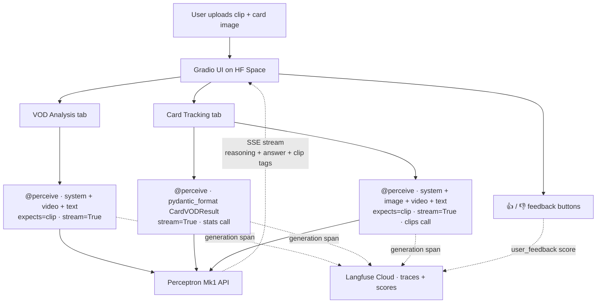
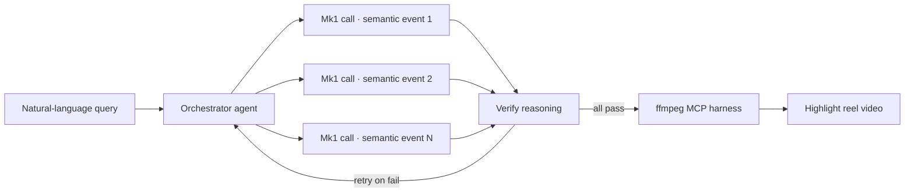

# Clash Royale VOD Reviewer — built on Perceptron Mk1

🔗 **Try it live (no setup):** https://huggingface.co/spaces/suhaas-teja/clash-royale-vod-reviewer
📓 **Step-by-step Colab notebook:** https://github.com/suhaasteja/VOD_reviewer

## Intro

**VOD analysis** — reviewing your own video-on-demand replays — is the most reliable way to improve at a competitive game, but doing it manually is slow and requires a trained eye. This project demonstrates how a **vision-language model (VLM)** with native video understanding can compress that loop into a single API call: drop in the final 30 seconds of a Clash Royale match and Perceptron's **Mk1** returns a coach-style review — what won or lost the game, the defining play, and timestamped clip ranges for any card deployment you ask about. No fine-tuning, no game-specific training data, no OCR pipeline, no per-class detector stack.

The build composes four of Mk1's core multimodal primitives in a single workflow: **native video Q&A with chain-of-thought reasoning**, **schema-constrained structured output via Pydantic**, **temporal grounding through `expects="clip"`** (returns parsed `Clip` objects with `at` / `until` timestamps), and **exemplar-based in-context learning (ICL)** from a single reference image. It's shipped as a streaming Gradio app on Hugging Face Spaces over **server-sent events (SSE)**, with a Colab notebook as the explainer doc and a Langfuse-backed **LLMOps observability and evaluation loop** capturing every trace.

## Why I chose this problem

I've spent enough hours getting good at competitive games to know the path: trial, error, occasional tutorial, mostly trial. Tutorials are too objective — they teach the meta, not your specific habits. The thing that actually improves your play is **reviewing your own VODs** and noticing what you did wrong. Pros and coaches do this constantly. Most players don't, because scrubbing through replay footage is tedious.

The existing **gameplay clipping and esports analytics** tooling is split into two camps and missing the middle:
- **Trigger-based automated clippers** — Powder, Medal, Outplayed, Eklipse. They fire on kill feeds, chat spikes, audio peaks. They detect that *something* happened but don't reason about *what* happened or *why* it mattered. No **semantic video search**, no natural-language interface.
- **Manual NLEs** — DaVinci, Premiere, OBS. The creator does all the cognitive work of finding, trimming, and labeling.

Neither talks to you in natural language about the game. *"Find the moment my opponent panicked and overcommitted elixir"* is a query a kill-counter can't answer and a non-linear editor can't volunteer. That gap is exactly where a **vision-language model with semantic understanding and temporal grounding** belongs.

The audience here is a real three-tier market: hobby gamers like me trying to improve, **creator-economy** content makers building highlight reels for Shorts/Reels/TikTok, and on the enterprise side, **esports broadcasters and game studios** (EA, Riot, Supercell) sitting on petabytes of broadcast tape they currently hand-curate. Same underlying primitive, three distinct buyer motions.

## Architecture

Two tabs, three Mk1 call sites, all wrapped in **Langfuse generation spans** that capture inputs, outputs, latency (including **time-to-first-token / TTFT**), token usage, and a `user_feedback` score tied to the same trace ID. The full application is one `app.py` plus a `requirements.txt`, deployable to any Gradio-compatible host.

## Methodology

The build went from notebook to production app in a deliberate sequence.

**1. Colab experimentation.** I prototyped every prompt, schema, and call shape in a Jupyter notebook first. Raw response inspection, fast iteration loop, no UI overhead. The notebook stayed in the repo as the explainer doc once the flows stabilized.

**2. Compression script for input video.** Raw mobile gameplay recordings are typically 600 MB+. Mk1 caps requests at 20 MB, so I wrote a small ffmpeg wrapper (`prep_clip.py`) that runs in two passes

Most first-time Mk1 calls fail not for model reasons but because the raw clip is too big. The 18 MB / 6 fps recipe ships reliably.

**3. Mk1 capability testing.** I exercised four features in the notebook before committing to the app design:
- **Video Q&A with chain-of-thought reasoning** (`question(..., reasoning=True)`) — the VOD diagnosis prompt; returns a `PerceiveResult` with both `text` and `reasoning` channels.
- **Temporal grounding via `expects="clip"`** — Mk1 emits self-closing `<clip />` tags inline in the response; the SDK parses them into `Clip` objects with `timestamp.at`, `timestamp.until`, and optional `mention` labels.
- **Exemplar-based in-context learning** — one reference card screenshot passed as an `image()` node, model performs **task adaptation without fine-tuning** to track that specific card across the gameplay video.
- **Schema-constrained structured output** via `pydantic_format(..., strict=True)` — `times_played: int`, `crossed_river: bool` returned as typed, JSON-schema-validated data, not free-text the consumer has to parse.

**4. Gradio app on Hugging Face Spaces.** Once the call shapes were stable, I lifted them into a single-file Gradio app. Two tabs (VOD analysis, card tracking), sample clip + sample card buttons for one-click onboarding, and **streaming inference everywhere** — `stream=True` on every Mk1 call, with Gradio's generator-based event handlers consuming the **SSE stream** and yielding reasoning and answer deltas to the UI as they arrive.

**5. LLMOps observability and a closed-loop evaluation harness.** Wired the Langfuse SDK to capture every click as a trace containing one or more **generation spans**: model inputs, structured outputs, streaming token usage, error class, completion start time (TTFT), and stream-delta histograms (reasoning vs text vs grounding tags). Added 👍 / 👎 buttons under each result that write a `user_feedback` numeric score back to the same trace, enabling **satisfaction-rate dashboards** sliced by card name and flow, and a **regression signal** when prompts change. The same plumbing supports running offline eval datasets through Langfuse later.

## Learnings

- **Specific, single-purpose prompts outperformed broad multi-ask prompts.** Asking "count deployments AND return clips AND classify role" in one call degraded every field. Splitting into focused calls — one for stats via Pydantic, one for clips via `expects="clip"` — made each call reliable.
- **Pydantic field descriptions were the highest-leverage adjustment I made.** Rewriting the `crossed_river` field description into an explicit decision tree with visual cues fixed a wrong "defensive" classification on Hog Rider. For structured-output calls, the schema effectively functions as part of the prompt.
- **A `system()` node stopped Mk1 from inventing card stats.** Before anchoring the model to "trust only what's visible in the frames; never recall card stats from prior knowledge," it was quoting damage numbers and ranges from memory. One system prompt resolved this across every call.
- **Streaming meaningfully improves perceived latency on 30–60 second calls.** Token-by-token reasoning + answer in the UI is significantly better UX than a blank screen with a spinner. About 30 lines of generator-handler glue in Gradio.
- **Langfuse + 👍 / 👎 made for a tight evaluation loop.** Every trace carries TTFT, token usage, error class, output distributions, and a user-feedback score. Satisfaction rate by card or regression detection after a prompt change become straightforward queries. Low cost to add, high signal.
- **Disambiguating the reference image from the video matters for ICL.** Without an explicit "this image is NOT part of the gameplay" framing node, Mk1 counted the reference card itself as a t=0.2s deployment and inflated counts. Straightforward fix once identified.

## Next steps

The most interesting extension is **wrapping this as an agentic clip-generation harness** — a perceptive agent built around the **Model Context Protocol (MCP)**. An orchestrator decomposes a natural-language user query into multiple parallel Mk1 calls (one per semantic event class), verifies each one's chain-of-thought against the returned grounding, retries on failure, and finally hands the validated clip windows off to an **ffmpeg MCP server** to render the highlight reel as a real video artifact.

Why this composition works:
- **Mk1 is fast and accurate on focused queries** — exactly the pattern these notebook learnings reinforced.
- **The model already returns grounded `<clip>` timestamps** — the orchestrator hands those directly to ffmpeg, no extra parsing layer.
- **Reasoning traces are verifiable** — the orchestrator can second-pass them with another LLM or with a constrained validator before committing the clip.

This is the architectural shape that takes the current demo from "a tool a hobbyist runs in a browser" to "a service a streamer or game studio runs over their entire backlog." Same Mk1 primitives, paired with the right orchestration and the right downstream tool.